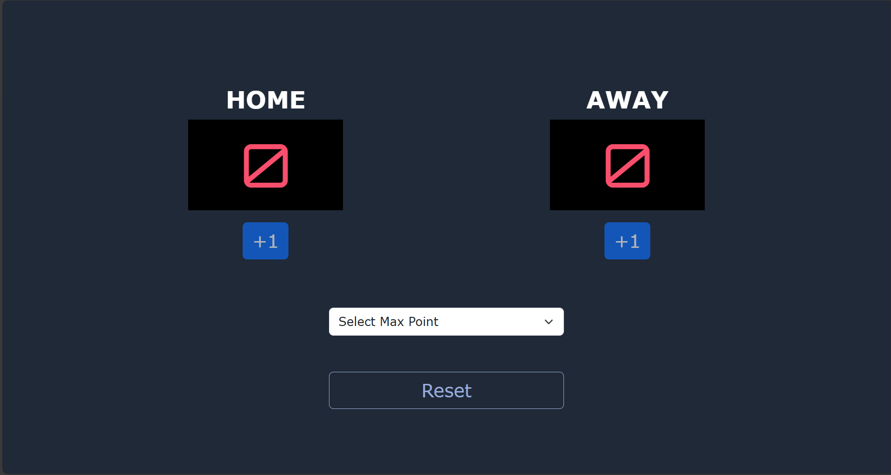

# 🏆 Scoreboard App

A simple and responsive web-based scoreboard application built with Bootstrap 5. This app allows users to track scores, set a custom score limit, and automatically determine the winner once the limit is reached.

## 🎮 Features

- ➕ Tambah atau reset skor secara manual
- 🎯 Atur batas skor kemenangan sesuai keinginan
- 🏁 Sistem akan otomatis menampilkan pemenang ketika skor tercapai
- ♻️ Tombol reset untuk memulai ulang pertandingan
- 📱 Desain responsif (mobile-friendly) menggunakan Bootstrap 5

## 🔗 Live Demo

👉 [Coba Sekarang](https://username.github.io/score-board/)

## 💻 Built With

- HTML
- CSS
- Bootstrap 5
- JavaScript

## 🚀 Getting Started

1. Buka file `index.html` di browser
2. Masukkan batas skor (misalnya 3, 5, 10, dst.)
3. Gunakan tombol `+` untuk menambah skor masing-masing pemain
4. Pemain yang pertama mencapai batas skor akan langsung menjadi pemenang
5. Gunakan tombol reset untuk memulai permainan baru

## 📸 Screenshot

